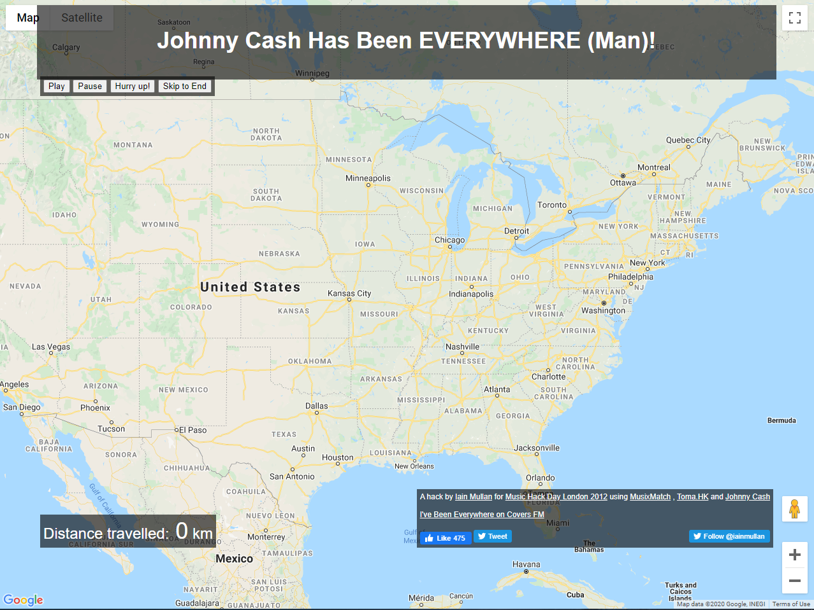
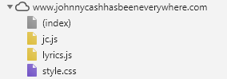
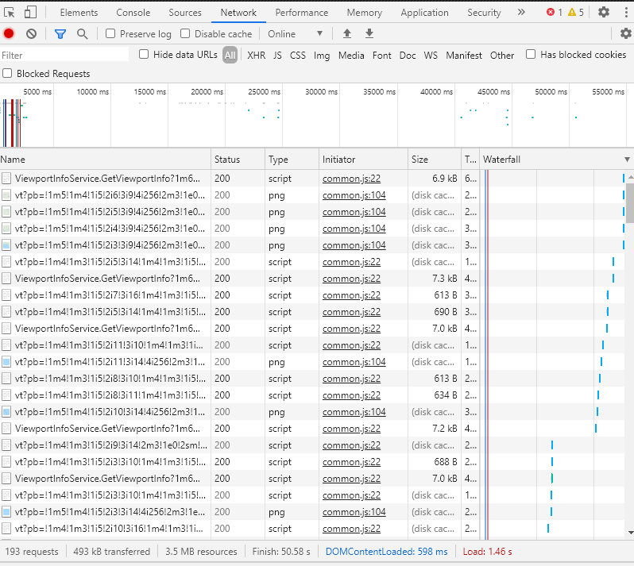
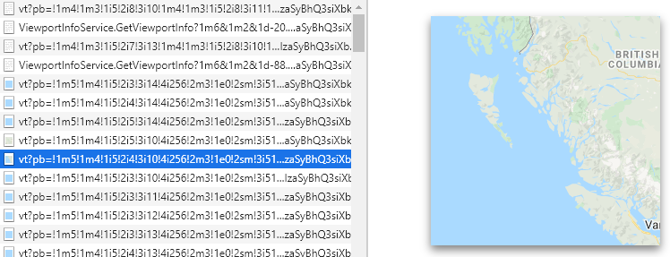

# Analyzing the "Johny Cash Has Been Everywhere" Web Map



The project can be found at http://www.johnnycashhasbeeneverywhere.com/

## Introduction
The goal of the project is to provide a chronological guide to the places Johny Cash mentiones in the "I've Been Everywhere" song. The project was created by Iain Mullan for Music Hack Day London 2012. The project was designed for entertainment purposes. On his website, Iain describes it as
>"A silly yet popular hack involving a map and some Johnny Cash lyrics."

The project has gone viral since it was first created and has been featured in multiple media outlets:
>"Makes for a fun technology demo." -The Verge

>"Perhaps one of my favorite music hacks of all time." -Music Machinery

## Major Functions
* Displays the lyrics to the "I've Been Everywhere" song in realtime on the top of the page. Every time Jonhny Cash mentions a place it is highlighted in green.
* `Play`, `Pause`, `Hurry up!`, and `Skip to End` interactive buttons controls the playback point in the song.
* Each time a place is mentioned in the song, the location is mapped and symbolized using an image of Johny Cash's face.
* Distanced traveled is displayed on the bottom right of the page.

## Target Audience
Since this project is meant for entertainment purposes, it is meant for and can be enjoyed by pretty much anyone. Especially fans of Johny Cash or music fans in general.

## Project Author
The project was created by Iain Mullan, a London based full-stack software developer. According to [Iain's website](https://iainmullan.com/), his recent roles focus around DevOps on Amazon Web Services. Iain currently works for Fitness Tech Group as a technical lead and has worked there since August 2019. 

## Systematic Architecture
This project is hosted on an external network, meaning it can be accessed by anyone using a web browser. Each user has access to their own web client. The web client then pulls information from the internal network, which consists of a web server. For this project, the web server stores the HTML, JavaScript, and CSS files that are used by the web client. For example, some of the files stored by the web server in this project are the `index.html`, `lyrics.js`, and `style.css` files.

The client also pulls information from other web servers. In the case of this project, the client is recieving map information from the Google Maps server and realtime song lyrics from the MusixMatch web server. 

## Inspecting the Code
### Data Flow
If we take a look at the Network tab in the Google Chrome Inspector tool we can see that the majority of the data that is being flowed between the client and the server is the google maps service data.


It appears as though each time the the map moves, the client is calling upon the google map service in order to recieve tile information on that particular section of the map:


It's also worth noting that the data is only fetched once in order to increase the performace of the website. For example, the image of Johny Cash's face is fetched in the begininng, but never fetched again even though it pops up on the map over and over again throughout the duration of the song.

### Major Libraries and APIs in Use
| Library/API     | Function                                                                                                |
|-----------------|---------------------------------------------------------------------------------------------------------|
| JQuery          | Simplifys HTML DOM tree traversal and manipulation, as well as event handling, CSS animation, and Ajax. |
| Google Maps API | Allows for use of the google map basemap with the ability to add layers, styles, events, and controls. |
| Musixmatch API  | Allows the lyrics to be displayed and synchronized with the song.                                       |
| Tomahk API      | Fetches and plays the audio of the song.                                                                |

### Responsive Design Support
Using the device toolbar in the Chrome Inspector tool we can see that the web map does support responsive design:


### Other Features
I also thought it would be cool to take a look at how the distance traveled is calculated. After inspecting the code, here is what I found:
``` javascript
var lat1 = lastPin.position.lat();
                    var lon1 = lastPin.position.lng();
                    var lat2 = marker.position.lat();
                    var lon2 = marker.position.lng();

                    var R = 6371; // km
                    var dLat = (lat2-lat1).toRad();
                    var dLon = (lon2-lon1).toRad();
                    var lat1 = lat1.toRad();
                    var lat2 = lat2.toRad();

                    var a = Math.sin(dLat/2) * Math.sin(dLat/2) +
                    Math.sin(dLon/2) * Math.sin(dLon/2) * Math.cos(lat1) * Math.cos(lat2);
                    var c = 2 * Math.atan2(Math.sqrt(a), Math.sqrt(1-a));
                    var d = R * c;

                    d = parseInt(d);

                    MM.distance = MM.distance + d;
                    $('#distance-num').html(MM.distance);
```

After inspection, it appears as though he is using the [haversine formula](https://www.geeksforgeeks.org/haversine-formula-to-find-distance-between-two-points-on-a-sphere/), which is a useful formula for calculating the distance of two points on a sphere using the latitude and longitude of each point.

## Data Sources
* **Vector Data:** `america_keyed.json` contains the names and coordinates of all the places Johny Cash mentions in the song. Mapped as point vectors using the google maps API.
* **Raster Data:** `google maps basic maps` consisting of roadmap, satellite, hybrid, and terrain basemap tiles provided by the Google Maps API. 

## Web Map Design

### UI/UX

### Basemap

### Thematic Layer

## Social Implications

## Summary

## References
* http://www.johnnycashhasbeeneverywhere.com/
* https://iainmullan.com/
* https://github.com/iainmullan/johnny-cash
* http://www.huffingtonpost.ca/2012/11/30/johnny-cash-ive-been-everywhere-man_n_2219886.html
* http://musicmachinery.com/2012/11/21/johnny-cash-has-been-everywhere-man/
* https://www.geeksforgeeks.org/haversine-formula-to-find-distance-between-two-points-on-a-sphere/
