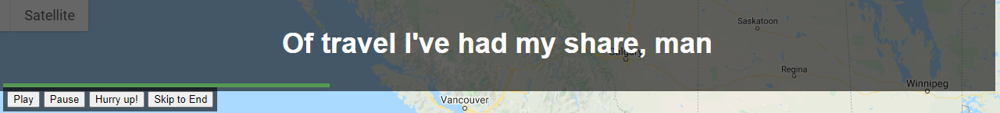
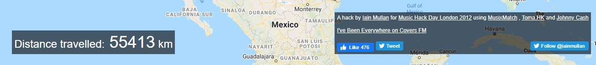

# Analyzing the "Johny Cash Has Been Everywhere" Web Map


The project can be found at http://www.johnnycashhasbeeneverywhere.com/

## Introduction
The goal of the project is to provide a chronological guide to the places Johny Cash mentions in the "I've Been Everywhere" song. The project was created by Iain Mullan for Music Hack Day London 2012. The project was designed for entertainment purposes. On his website, Iain describes it as
>"A silly yet popular hack involving a map and some Johnny Cash lyrics."

The project has gone viral since it was first created in 2012 and has been featured in multiple media outlets:
>"Makes for a fun technology demo." -The Verge

>"Perhaps one of my favorite music hacks of all time." -Music Machinery

I chose to analyze this web map because it is light hearted, and with everything going on in the world right now it's a great website to visit if you just want to take your mind off things for a little while. 

## Major Functions
* Displays the lyrics to the "I've Been Everywhere" song in real-time on the top of the page. Every time Johny Cash mentions a place it is highlighted in green.
* `Play`, `Pause`, `Hurry up!`, and `Skip to End` interactive buttons control the playback point in the song.
* Each time a place is mentioned in the song, the location is mapped and symbolized using an image of Johny Cash's face.
* Distanced traveled is displayed on the bottom left of the page.

## Target Audience
Since this project is designed for entertainment purposes, it is meant for and can be enjoyed by pretty much anyone. Especially fans of Johny Cash or music fans in general.

## About the Project Author
The project was created by Iain Mullan, a London based full-stack software developer. According to [Iain's website](https://iainmullan.com/), his recent roles focus around DevOps on Amazon Web Services. Iain currently works for Fitness Tech Group as a technical lead and has worked there since August 2019. 

## Systematic Architecture
This project is hosted on an external network, meaning it can be accessed by anyone using a web browser. Each user has access to their own web client. The web client then pulls information from the internal network, which consists of a web server. For this project, the web server stores the HTML, JavaScript, and CSS files that are used by the web client. For example, some of the files stored by the web server in this project are the `index.html`, `lyrics.js`, and `style.css` files.


The client also pulls information from other web servers. In the case of this project, the client is receiving map information from the Google Maps server and real-time song lyrics from the MusixMatch web server. 

## Inspecting the Code
### Data Flow
If we take a look at the Network tab in the Google Chrome Inspector tool we can see that the majority of the data that is being flowed between the client and the server is the google maps service data.


It appears as though each time the map moves, the client is calling upon the google map service in order to receive tile information on that particular section of the map:


It's also worth noting that the data is only fetched once in order to increase the performance of the website. For example, the image of Johny Cash's face is fetched in the beginning, but never fetched again even though it pops up on the map over and over again throughout the duration of the song.

### Major Libraries and APIs in Use
| Library/API     | Function                                                                                                |
|-----------------|---------------------------------------------------------------------------------------------------------|
| JQuery          | Simplifys HTML DOM tree traversal and manipulation, as well as event handling, CSS animation, and Ajax. |
| Google Maps API | Allows for use of the google map basemap with the ability to add layers, styles, events, and controls.  |
| Musixmatch API  | Allows the lyrics to be displayed and synchronized with the song.                                       |
| Toma.hk API     | Fetches and plays the audio of the song.                                                                |

### Responsive Design Support
Using the device toolbar in the Chrome Inspector tool we can see that the web map does support responsive design:


It's worth noting that although the web map supports responsive design, it appears as though the website does not support devices using Internet Explorer. If you want to be able to enjoy the full experience of the website you will have to use Chrome, Firefox, or Safari. The exception handler in the code can be seen here:
``` javascript
$(document).ready(function() {
    if ($.browser.msie) { alert("Using Internet Explorer? Johnny requires Chrome/Firefox/Safari to play audio. (sorry!)");}
```

### Other Features
I also thought it would be interesting to take a look at how the distance traveled is calculated. After inspecting the code, here is what I found:
``` javascript
var lat1 = lastPin.position.lat();
                    var lon1 = lastPin.position.lng();
                    var lat2 = marker.position.lat();
                    var lon2 = marker.position.lng();

                    var R = 6371; // km
                    var dLat = (lat2-lat1).toRad();
                    var dLon = (lon2-lon1).toRad();
                    var lat1 = lat1.toRad();
                    var lat2 = lat2.toRad();

                    var a = Math.sin(dLat/2) * Math.sin(dLat/2) +
                    Math.sin(dLon/2) * Math.sin(dLon/2) * Math.cos(lat1) * Math.cos(lat2);
                    var c = 2 * Math.atan2(Math.sqrt(a), Math.sqrt(1-a));
                    var d = R * c;

                    d = parseInt(d);

                    MM.distance = MM.distance + d;
                    $('#distance-num').html(MM.distance);
```

After inspection, it appears as though he is using the [haversine formula](https://www.geeksforgeeks.org/haversine-formula-to-find-distance-between-two-points-on-a-sphere/), which is a useful formula for calculating the distance of two points on a sphere using the latitude and longitude of each point.

## Data Sources
* **Vector Data:** `america_keyed.json` contains the names and coordinates of all the places Johny Cash mentions in the song. Mapped as point vectors using the google maps API.
* **Raster Data:** `google maps basic maps` consisting of roadmap, satellite, hybrid, and terrain basemap tiles provided by the Google Maps API. 
* **Nonspatial Data:** `jc.mp3` stores the fetched audio mp3 file of the song from the Toma.hk API. 

## Web Map Design

### UI/UX
This project has a relatively basic UI/UX design, which for the most part works well. The top of the page features the panel that displays the lyrics in real-time and contains buttons that let you control the playback of the song.

Unfortunately, the buttons do not allow you to rewind the song, so if you want to go back you will be forced to refresh the page and start the song over again. The fact that you can't rewind and fast forward efficiently is probably the project's biggest flaw.

Two more panels can be found at the bottom of the page. One contains the distance traveled, and the other is used for acknowledgments and links to follow Iain.

As far as I'm concerned, there is nothing wrong with the design of these panels since they are small and out of the way of the map view.

### Basemap
The project's default basemap is Google Map's basic roadmap, which is perfect for a project like this since it shows roads, states, and major cities without overloading the user with information. The basemap can also be changed to a satellite or terrain basemap by using clicking the map buttons located at the top right corner of the page. However, I would not suggest changing it since the roadmap is the most effective. More information about the available basemaps can be found on the [Google Maps API documentation page](https://developers.google.com/maps/documentation/javascript/maptypes#BasicMapTypes).

### Thematic Layer
The thematic layer for this project is the places mentioned by Johny Cash in the "I've Been Everywhere" song. Each place is mapped in real-time when it is mentioned in the song. The layer is symbolized using an image of Johny Cash's face. You can interact with the layer by hovering your mouse over each individual Johny Cash face, and the name of the place will be displayed. 

### Other Map Elements


* Zoom In/Out Buttons: Allows you to zoom in or out of the map.
* Open Street View Button: Allows you to drag and open Google Street View anywhere on the map. Allowing you to get an up-close and personal view of the specific places Johny Cash mentions in the song. 

## Strengths
* Light hearted and entertaining.
* Simple, but effective design.

## Weaknesses
* Lacks the ability to rewind, and there are limited fast-forward options.
* Uses HTTP, and thus is less secure compared to HTTPS.

## Reflection
Even though this project might not use any cutting edge technology to solve any real world problems, or tell a meaningful story with a powerful message behind it doesn't mean you should write it off. In fact, the reason that the project is so popular might be because it is "silly" or light hearted. Sometimes people need a break from all the stress and anxieties of the world, and this project is perfect for that reason. 

At its core, this project is a music project, and there have been countless studies proving that music can have a positive impact on one's health. According to Medical News Today, music can reduce pain and anxiety, relieve stress, help with recalling memories, help patients recover from brain injuries, and treat seizures. This project will probably not be used to treat brain injuries, but there's no reason to believe that it is incapable of providing any health benefits. Even if it is as simple as making you smile for a minute or two. I hope the project brings you joy as it did for me.  

## References
* http://www.johnnycashhasbeeneverywhere.com/
* https://iainmullan.com/
* https://github.com/iainmullan/johnny-cash
* http://www.huffingtonpost.ca/2012/11/30/johnny-cash-ive-been-everywhere-man_n_2219886.html
* http://musicmachinery.com/2012/11/21/johnny-cash-has-been-everywhere-man/
* https://www.geeksforgeeks.org/haversine-formula-to-find-distance-between-two-points-on-a-sphere/
* https://www.medicalnewstoday.com/articles/302903
